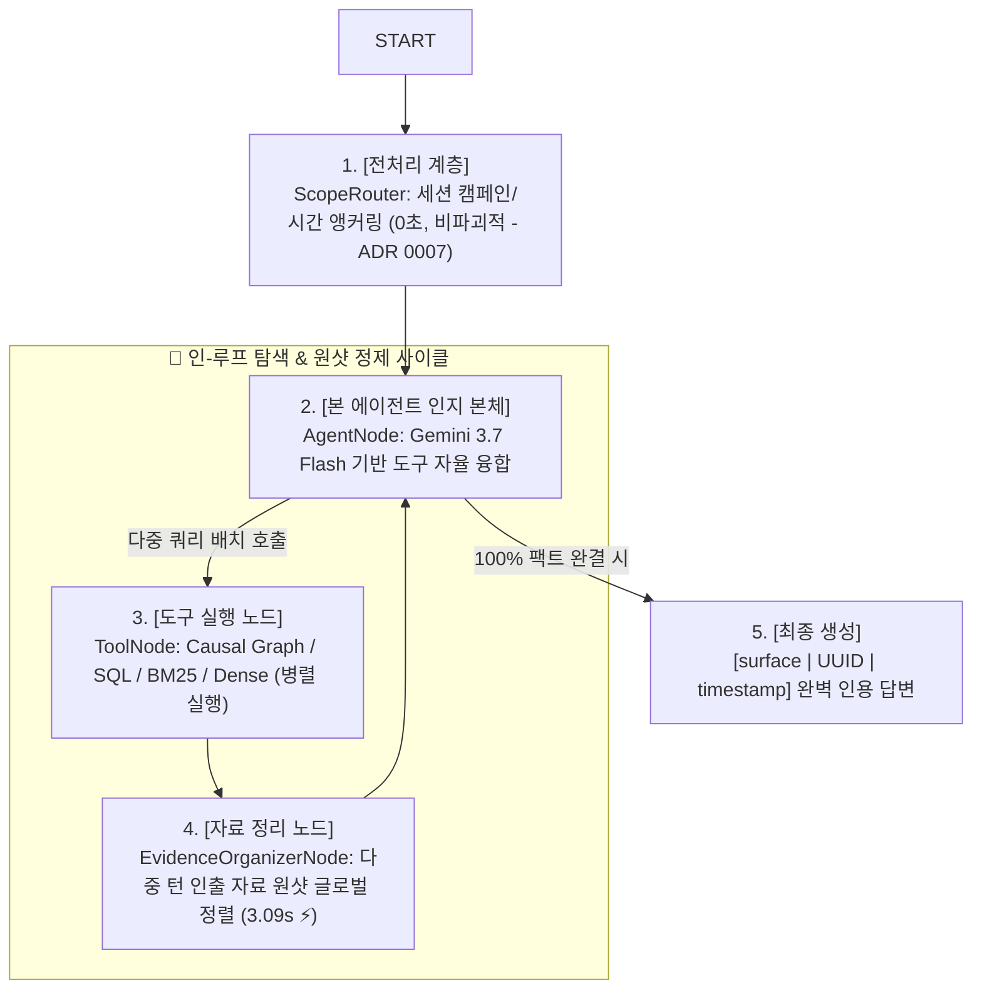

# 📚 LaunchPilot 공식 엔지니어링 문서 허브 (Documentation Hub)

마케팅 도메인 특화 인과 분석 AI 에이전트 **LaunchPilot**의 아키텍처, 실측 벤치마크 보고서, 아키텍처 결정서(ADR) 및 공식 PR 문서를 모아둔 단일 진실 공급원(Single Source of Truth) 허브입니다.

---

## 🧭 문서 디렉토리 구조 (Directory Layout)

```text
docs/
├── README.md                           # 🧭 전체 문서 내비게이션 허브 (본 문서)
├── pull-request.md                     # 🚀 공식 PR 본문 (PR Description Master)
│
├── architecture/                       # 🏛️ 시스템 설계 및 아키텍처
│   ├── system-architecture.md          # • LangGraph 4계층 순환 인지 토폴로지 (C3 다이어그램)
│   ├── evaluation-framework.md         # • Problem 중심 Eval 데이터·실행 아키텍처
│   ├── multitenancy-design.html        # 🔐 멀티테넌시 6계층 상세 설계 (To-Be)
│   ├── memory-langgraph-design.html    # 🧠 대화 메모리 · LangGraph 심화 설계 (To-Be)
│   └── adr/                            # • 아키텍처 결정서 (Architecture Decision Records)
│       ├── 0001-retrieval-storage-strategy.md
│       ├── 0002-source-of-truth-database.md
│       ├── 0003-feature-oriented-modular-monolith.md
│       ├── 0004-chunking-strategy.md
│       ├── 0005-reranking-strategy.md
│       ├── 0006-routing-strategy.md
│       └── 0007-elimination-of-intent-parser-in-preprocessing.md
│
└── reports/                            # 📊 실측 실험 및 벤치마크 보고서
    ├── evaluation-system-audit.md      # 🔎 Golden/Eval/Grader/Experiment 적대적 감사와 최소 재설계
    ├── master-engineering-report.md    # 📘 과거 V1~V3 실험 기록(감사 전 proxy 결과 포함)
    └── dataset-evolution.md            # 🧪 V1 ➔ V2 ➔ V3 데이터셋 진화 및 적대적 감사 아키텍처
```

---

## 📌 핵심 문서 바로가기

| 카테고리 | 핵심 문서 | 주요 내용 |
| :--- | :--- | :--- |
| **🚀 Pull Request** | [docs/pull-request.md](pull-request.md) | V3 데이터셋 및 LangGraph 인-루프 파이프라인 완성 공식 PR 본문 |
| **🔎 Evaluation 감사** | [docs/reports/evaluation-system-audit.md](reports/evaluation-system-audit.md) | Golden V1~V3, qrels, grader, runner, 과거 결과의 유효 범위와 최소 재설계 |
| **🧭 Eval 정문** | [services/launchpilot-api/evals/README.md](../services/launchpilot-api/evals/README.md) | 문제→답 멘탈 모델, canonical dataset tree, 파일별 읽는 법과 현재 release blocker |
| **🗂️ Task dataset** | [services/launchpilot-api/evals/datasets/README.md](../services/launchpilot-api/evals/datasets/README.md) | 구현 독립적 world/problem/spec/judgment/reference 계약 |
| **🧰 Eval portfolio 운영** | [services/launchpilot-api/evals/portfolio/README.md](../services/launchpilot-api/evals/portfolio/README.md) | Historical 동결, Frozen/Holdout 후보, pooling, controlled run의 현재 상태와 사용 경계 |
| **📘 과거 실험 기록** | [docs/reports/master-engineering-report.md](reports/master-engineering-report.md) | 데이터셋 진화와 ablation 기록. 품질 주장은 Eval 감사의 유효 범위 안에서 해석 |
| **🏛️ 시스템 아키텍처** | [docs/architecture/system-architecture.md](architecture/system-architecture.md) | 전처리 ➔ 본체 에이전트 ➔ 도구 ➔ 인-루프 리랭커 순환 토폴로지 |
| **🎯 Evaluation architecture** | [docs/architecture/evaluation-framework.md](architecture/evaluation-framework.md) | Problem/Spec/Trial 분리, 관계별 평가, paired architecture experiment |
| **🔐 멀티테넌시 설계** | [docs/architecture/multitenancy-design.html](architecture/multitenancy-design.html) | `workspace_id` 배턴을 6계층에 관통시키는 테넌트 격리 To-Be 설계 (JWT·RLS·감사) |
| **🧠 메모리 · LangGraph** | [docs/architecture/memory-langgraph-design.html](architecture/memory-langgraph-design.html) | 체크포인터·요약(compaction)·RLS 격리로 "이어지는 대화"를 만드는 심화 설계 |

> 위 두 설계 문서는 다이어그램·테마가 포함된 **스탠드얼론 HTML**입니다. GitHub는 HTML을 인라인 렌더링하지 않으니, 파일을 내려받아 브라우저로 열거나 `htmlpreview.github.io` 로 보세요.
| **🧪 데이터셋 진화** | [docs/reports/dataset-evolution.md](reports/dataset-evolution.md) | 30개 캠페인, 1,050개 코퍼스, 150건 무편향 블라인드 질의 설계 |
| **📝 아키텍처 결정서** | [docs/architecture/adr/](architecture/adr/) | ADR 0001 ~ ADR 0007 핵심 설계 의사결정 기록 |

---

## 🏛️ 확정된 LangGraph 순환 인지 토폴로지


