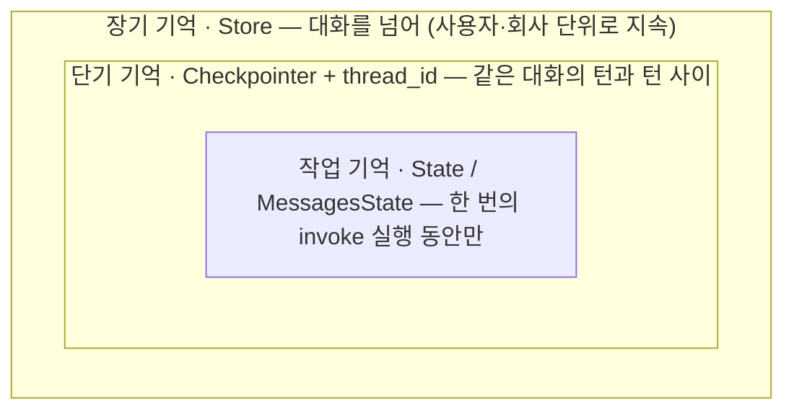
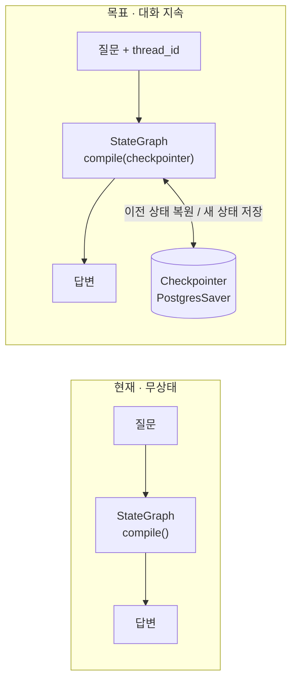
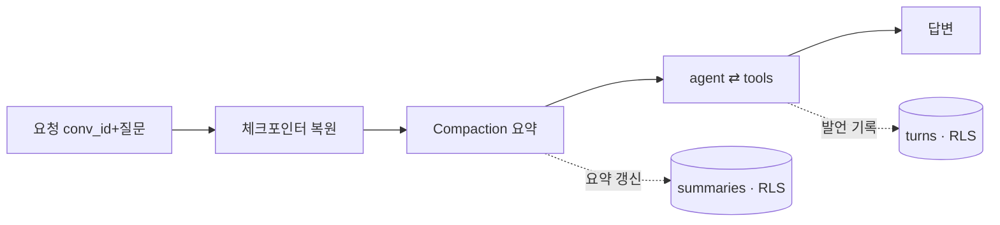
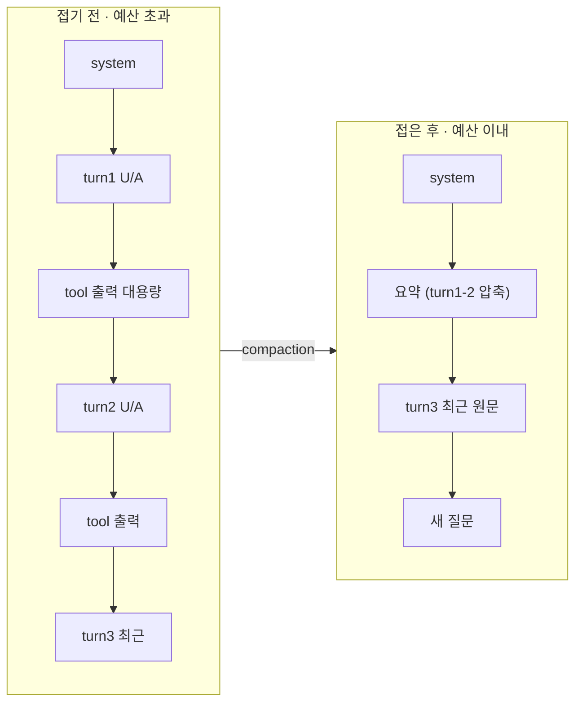

# 🧠 대화 메모리 · LangGraph 심화 설계 (Conversation Memory Design)

> **BLUF**: 무상태 에이전트를 "이어지는 대화"로 바꾸기 위한 심화 설계. **LangGraph 체크포인터로 대화 지속을 얻고, 요약(compaction)으로 비용을, RLS로 테넌트를 통제한다.** 기존 `agent ⇄ tools` 토폴로지는 그대로 두고, 컴파일과 실행 두 지점만 바꾼다.

- **기준 코드**: `services/launchpilot-api/src/launchpilot/analysis/graph.py` (`AnalysisGraph`)
- **스택**: LangGraph · PostgreSQL 17
- **관련 문서**: [multitenancy-design.md](multitenancy-design.md) (⑤ 메모리 계층의 상위 맥락)

---

## §0 무엇을 풀려는가

지금 에이전트는 매 질문을 **백지에서** 답한다. 코드로 보면 `AnalysisGraph.invoke`가 매번 `{"messages": [HumanMessage(질문)]}` 하나만 그래프에 넣고, `graph.compile()`에는 아무 저장 장치도 붙어 있지 않기 때문이다. 그래서 사용자가 "그럼 그 캠페인 예산은?"처럼 앞 대화를 이어 물으면, 에이전트는 "그 캠페인"이 무엇인지 모른다.

이 문서는 그 대화를 **기억**하게 만든다. 핵심은 두 가지다 — 첫째, LangGraph가 원래 제공하는 메모리 장치(체크포인터·스토어)를 정확히 어디에 끼우는지. 둘째, 그 기억이 커질 때 비용이 폭발하지 않게, 그리고 A사 대화가 B사에 새지 않게 통제하는 것. LangGraph는 기억할 **수단**을 주지만, "무엇을·얼마나·누구 것만" 기억할지는 우리가 설계해야 한다.

> **관점**: LangGraph 체크포인터로 "이어지는 대화"를 얻되, 그 위에 요약(compaction)으로 비용을, RLS로 테넌트를 통제한다.

---

## §1 먼저, LangGraph의 메모리 3층 모델

LangGraph에서 "메모리"는 한 덩어리가 아니라 **수명(범위)이 다른 세 겹**이다. 이 셋을 구분하는 것이 설계의 출발점이다.

*범위가 서로를 감싼다. 가장 안쪽 State는 한 번의 실행 안에서만 살고(지금 우리가 쓰는 유일한 층), 체크포인터는 같은 대화의 턴들을 잇고, 스토어는 대화를 넘어 오래 보관한다. 지금 코드에는 가장 안쪽 한 겹만 있다.*

| 층 | LangGraph 구성 | 수명(범위) | 무엇을 담나 |
| :--- | :--- | :--- | :--- |
| 작업 기억 | `State` · `MessagesState` | 1회 실행 | 이번 턴의 메시지·툴 호출·중간 추론 |
| 단기 기억 | `Checkpointer` + `thread_id` | 1개 대화 | 지난 턴들의 메시지(대화 맥락) |
| 장기 기억 | `Store` (`BaseStore`) | 사용자·회사 | 대화를 넘는 사실 — 선호·반복 컨텍스트 |

이 문서의 중심은 **단기 기억(체크포인터)** — "대화가 이어지는 감각"이 여기서 나온다. 장기 기억(스토어)은 뒤에서 짧게 다룬다.

---

## §2 우리 그래프에 어떻게 끼우나 — 현재 → 목표

기존 `AnalysisGraph`의 토폴로지(`router → agent ⇄ tools → reranker`)는 **그대로 둔다**. 바꾸는 것은 딱 두 곳 — 그래프를 **컴파일할 때 체크포인터를 붙이고**, **실행할 때 `thread_id`를 넘기는** 것. 이 둘만으로 LangGraph가 대화 상태를 자동으로 이어 준다.

*바뀌는 건 두 곳뿐. `compile()`에 체크포인터를 붙이고, `invoke`에 `thread_id`(= `conversation_id`)를 넘기면, LangGraph가 그 대화의 이전 `MessagesState`를 자동 복원하고 실행 후 다시 저장한다.*

| 변경 지점 | 현재 | 목표 |
| :--- | :--- | :--- |
| `AnalysisGraph._compile` | `graph.compile()` | `graph.compile(checkpointer=PostgresSaver)` + compaction 노드 |
| `AnalysisGraph.invoke` | `invoke({"messages":[Human]})` | `invoke({"messages":[Human]}, config={"configurable":{"thread_id": conversation_id}})` |
| `CampaignAgent.answer` | `answer(question)` | `answer(conversation_id, question)` → 실행 후 turns 저장 |
| `CampaignAgentFactory.create` | 체크포인터·저장소 없음 | checkpointer · `ConversationStore` · `SummaryStore` 주입 |
| 신규 스키마 | — | `turns` · `conversation_summaries` (+RLS), (선택) Store 네임스페이스 |

> **왜 체크포인터만으로 끝내지 않나.** 체크포인터는 작업 루프 전체(agent⇄tools의 원시 툴 출력·리랭커 트래픽까지)를 저장한다. 다음 턴에 그걸 통째로 다시 넣으면 토큰이 폭발한다. 그래서 §4 요약(compaction)으로 상태를 접고, 제품·감사용 진실 원본은 별도 `turns` 테이블(RLS)에 따로 둔다.

---

## §3 데이터 모델 — 무엇을 어디에 저장하나

저장소는 성격이 다른 **세 부류**로 나뉜다: LangGraph가 스스로 관리하는 체크포인트 테이블(런타임), 우리가 만드는 제품 진실 원본(turns·summaries), 그리고 장기 사실(Store). 진실 원본과 런타임 캐시를 섞지 않는 것이 핵심이다.

| 테이블 | 주요 컬럼 | 누가 관리 | 역할 / 이유 |
| :--- | :--- | :--- | :--- |
| `conversations` *(기존)* | id · campaign_id · title · created_at | 우리 | 대화 단위. `id`가 곧 `thread_id`가 된다. |
| `turns` **NEW** | id · conversation_id · **workspace_id** · role · content · tool_calls(JSONB) · token_count · created_at | 우리 | **제품 진실 원본** — 화면 표시·감사·다음 턴 재구성. RLS 적용. |
| `conversation_summaries` **NEW** | conversation_id · **workspace_id** · summary · upto_seq · updated_at | 우리 | 오래된 턴을 접은 러닝 요약. 어디까지 요약했는지(`upto_seq`) 기록. |
| `checkpoints*` *(LangGraph)* | thread_id · checkpoint · (state blob) | LangGraph | 런타임 상태. `PostgresSaver.setup()`이 자동 생성. **캐시로 취급**. |
| `store*` *(LangGraph)* | namespace · key · value(JSONB) | LangGraph | 장기 사실. `namespace=(workspace_id, …)`로 회사 격리. |

`*` 표시는 LangGraph가 `.setup()`으로 만들고 관리하는 테이블 — 우리는 스키마를 손대지 않고 **런타임 캐시**로 다룬다.

---

## §4 한 턴의 처리 흐름 (요약 포함)

한 번의 질문이 들어와 답이 나가기까지, 기억을 **복원 → 예산 맞춰 접기 → 추론 → 저장**의 순서로 다룬다. 기존 `agent ⇄ tools` 루프는 4단계 안에서 그대로 돈다.

1. 요청이 `conversation_id`·질문을 들고 오면, 시스템은 **대화→캠페인→회사** 체인으로 스코프를 인증해 이 대화가 요청자의 회사 것임을 확정한다.
2. **체크포인터**가 `thread_id=conversation_id`로 이전 턴의 상태를 자동 복원해, 에이전트가 앞 맥락 위에서 답하도록 한다.
3. **Compaction 노드**가 상태의 메시지가 토큰 예산을 넘겼는지 확인하고, 넘겼으면 오래된 메시지를 요약으로 접어(`RemoveMessage`로 제거) 창을 일정하게 유지한다.
4. 기존 **agent ⇄ tools** 루프가 복원된 맥락 + 요약 + 새 질문으로 추론해 답과 근거를 만든다.
5. **`ConversationStore`**가 사용자·assistant 발언을 `turns`에 회사 표식과 함께 append하고, 접힌 부분이 있으면 **`SummaryStore`**가 요약을 갱신한다 — 다음 턴이 이어질 근거가 남는다.

---

## §5 요약(Compaction) — 대화가 길어질 때

대화가 길어질수록 매 턴 전체 이력을 LLM에 넣는 비용·지연·환각이 커진다. 그래서 **최근 몇 턴은 원문 그대로, 그보다 오래된 것은 요약 한 덩어리로** 접는다 — "슬라이딩 윈도우 + 러닝 요약" 전략.

*오래된 것은 접고, 최근 것은 남긴다. 요약된 원문 턴도 `turns`에는 지우지 않고 보존한다.*

- **[언제]** 상태 메시지가 토큰/턴 임계를 넘으면 접는다 — 매 턴이 아니라 넘칠 때만, 불필요한 요약 호출을 아낀다.
- **[무엇을]** 오래된 턴은 요약으로, 최근 N턴은 원문 유지 — 방금 나눈 맥락은 손실 없이, 먼 맥락은 압축해 비용을 잡는다.
- **[어떻게]** LangGraph의 `RemoveMessage`로 상태에서 옛 메시지를 걷어내고 요약 메시지로 대체한다 — 상태는 가벼워지고 의미는 남는다.
- **[주의]** 지난 턴의 원시 툴 출력은 다음 턴에 재주입하지 않는다(요약으로 대체) — 이걸 안 하면 토큰이 가장 빨리 터진다.
- **[주의]** 요약은 손실 압축이므로 원문 `turns`는 지우지 않는다 — 이력·감사·재구성의 근거를 보존한다.

---

## §6 기억의 테넌트 격리 — 여기서 뚫리면 헛수고

앞선 멀티테넌시 설계의 배턴(`workspace_id`)은 기억 계층에서도 끊기면 안 된다. 애써 세운 격리가 메모리에서 새면 A사 대화가 B사 회상에 섞인다.

- **[규칙]** `turns`·`conversation_summaries`에 `workspace_id` 컬럼 + RLS를 걸어, 각 회사가 자기 대화만 읽고 쓰게 DB가 강제한다.
- **[규칙]** `thread_id = conversation_id`이고 대화는 캠페인→회사에 묶이므로, 스코프 인증을 통과한 대화의 thread만 실행에 쓴다.
- **[규칙]** 장기 스토어는 `namespace=(workspace_id, …)`로 회사를 네임스페이스에 박아 교차 조회를 원천 차단한다.
- **[주의]** 체크포인터 테이블은 LangGraph 관리라 `workspace_id` 컬럼이 없다 — 그래서 진실 원본이 아닌 캐시로만 다루고, 격리는 "인증된 대화의 thread만 접근"으로 지킨다. 민감하면 대화별 체크포인터 분리·주기적 정리를 둔다.

---

## §7 컴포넌트와 책임

- **`CheckpointerProvider`** *(NEW · LangGraph)* — 대화가 턴을 넘어 이어지게 하려고, `PostgresSaver`를 만들어 그래프 `compile`에 붙인다. 그 결과 `thread_id`만 넘기면 이전 `MessagesState`가 자동으로 복원·저장된다.
- **`CompactionNode`** *(NEW)* — 긴 대화의 토큰 비용을 잡으려고, 상태가 예산을 넘으면 오래된 메시지를 요약으로 접고 `RemoveMessage`로 걷어낸다. 대화가 길어져도 매 턴 입력 크기가 일정하게 유지된다.
- **`ConversationStore`** *(NEW)* — 화면 표시·감사·다음 턴 재구성의 근거를 남기려고, 오간 발언을 회사 표식과 함께 `turns`에 append하고 최근 것을 되읽어준다. RLS 아래 있어 회사는 자기 대화만 본다.
- **`SummaryStore` / `Summarizer`** *(NEW)* — 접힌 옛 맥락을 잃지 않으려고, 러닝 요약을 만들어 `conversation_summaries`에 보관하고 "어디까지 요약했는지"를 기록한다. 다음 복원 때 이 요약이 먼 맥락을 대신한다.
- **`LongTermStore`** *(NEW · LangGraph)* — 대화를 넘어 반복되는 사실(선호·자주 쓰는 캠페인)을 기억하려고, `BaseStore`에 `namespace=(workspace_id, …)`로 담는다. 새 대화도 회사의 축적된 맥락 위에서 시작할 수 있다.

---

## §8 규칙과 예외 상황

- **[규칙]** 진실 원본은 `turns`, 체크포인터는 런타임 캐시 — 둘이 어긋나면 turns를 기준으로 삼고 캐시는 버릴 수 있다.
- **[동시성]** 같은 대화에 두 요청이 겹치면 상태가 꼬일 수 있으므로, 대화 단위 직렬화(잠금/큐)로 한 번에 한 턴만 처리한다.
- **[새 대화]** `thread_id`가 없으면 새 대화로 보고 빈 상태에서 시작 — 이전 대화와 절대 섞지 않는다.
- **[요약 실패]** 요약 LLM 호출이 실패하면, 접지 않고 안전하게 트림(최근 N턴만)으로 폴백해 대화가 끊기지 않게 한다.
- **[규칙]** 도구가 조회할 스코프는 항상 인증된 배턴에서만 나오게 해, 기억을 이어받더라도 남의 회사 데이터가 답에 섞이지 않게 한다.

---

## §9 맺음

LangGraph는 기억할 **수단** 두 가지 — 턴을 잇는 체크포인터, 대화를 넘는 스토어 — 를 준다. 우리 몫은 그 위에 세 가지를 얹는 것이다: **요약**으로 비용을, **RLS**로 회사를, **turns 진실 원본**으로 신뢰를. 기존 `agent ⇄ tools` 토폴로지는 그대로 두고, 컴파일과 실행 두 지점만 바꾸면 시작할 수 있다.

> **체크포인터로 이어지는 대화를 얻고, 요약으로 접고, `workspace_id`로 가른다** — 이 셋이 "기억하되 새지 않고 비싸지 않은" 에이전트의 설계 요건이다.

---

> ⚠️ **구현 참고**: 본 문서의 LangGraph API(`PostgresSaver`, `thread_id` config, `BaseStore`, `RemoveMessage`)는 설계 시점 기준이다. 실제 구현 시 사용하는 `langgraph` 버전의 정확한 시그니처를 확인할 것. 요약 노드는 이 저장소의 커스텀 `StateGraph`에 맞춰 별도 노드로 설계했다(프리빌트 `create_react_agent`의 `pre_model_hook`이 아님).
