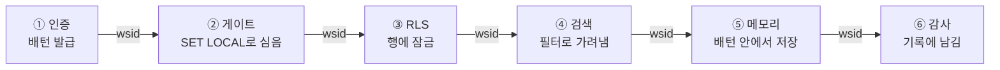
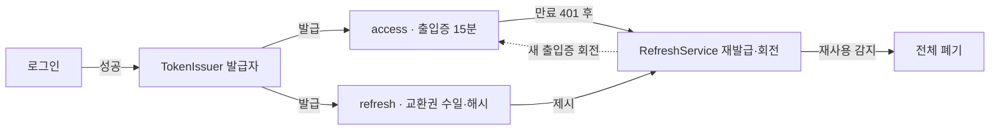
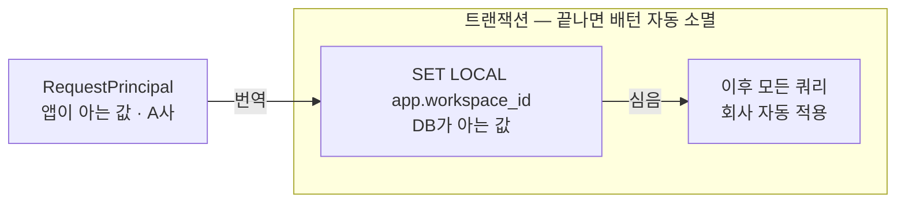
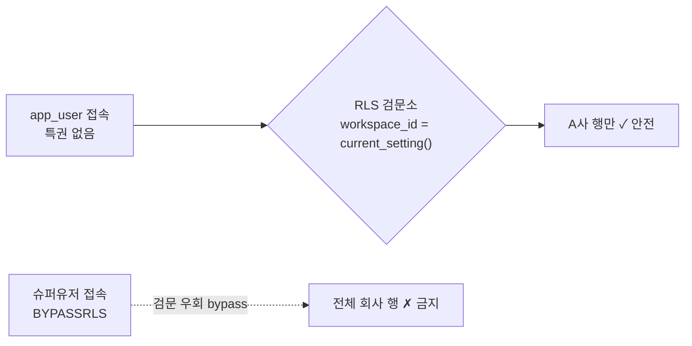
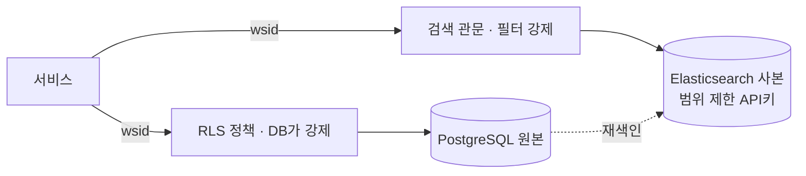
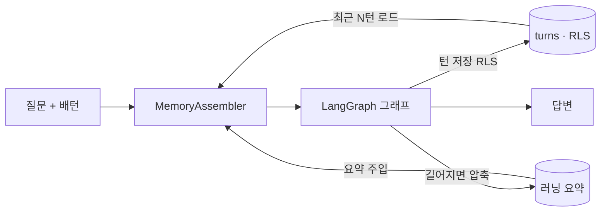
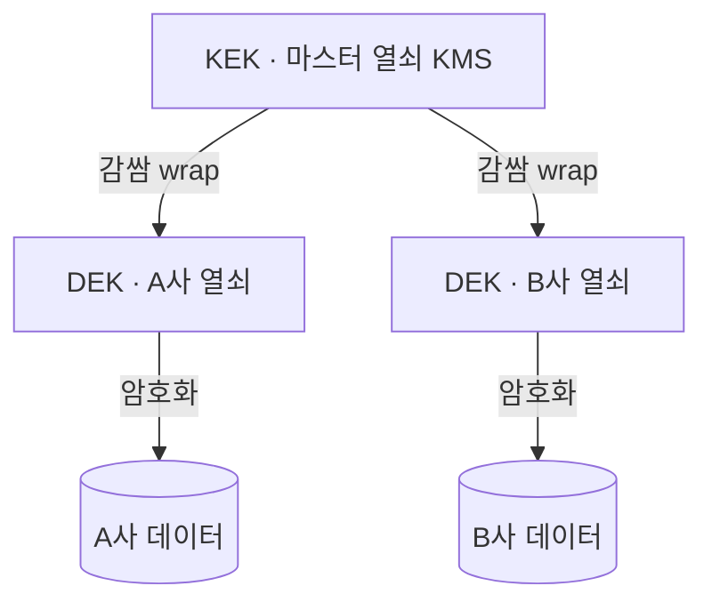

# 🔐 멀티테넌시 6계층 상세 설계 (Multi-Tenancy Design)

> **BLUF**: 여러 회사(A사·B사·C사)가 한 서비스를 나눠 쓸 때, A사 데이터가 B사에 새지 않는 격리를 **개발자의 조심성이 아니라 시스템 구조**로 보장하기 위한 To-Be 설계. 핵심은 `workspace_id`라는 **단 하나의 테넌트 표식**을 릴레이 배턴처럼 요청의 처음부터 끝까지 놓치지 않고 전달하는 것.

- **대상**: To-Be 구현안 (현재는 1인 프로토타입)
- **스택**: FastAPI · PostgreSQL 17 · Elasticsearch · LangGraph
- **관련 문서**: [memory-langgraph-design.md](memory-langgraph-design.md) (⑤ 메모리 심화), [system-architecture.md](system-architecture.md)

---

## 0. 이 문서가 하려는 이야기

지금 LaunchPilot은 **한 사람이 쓰는 프로토타입**이다. 하지만 곧 서로 다른 회사의 마케터들이 같은 서비스에 각자 로그인해 **자기 회사의 광고 데이터만**을 묻게 된다. 이때 단 한 번이라도 A사의 질문이나 데이터가 B사 화면에 새어 나가면, 그것은 사소한 버그가 아니라 **신뢰의 붕괴이자 계약 위반**이다. 그래서 이 서비스에서 격리(isolation)는 나중에 붙이는 기능이 아니라 처음부터 깔려 있어야 하는 전제다.

격리를 지키는 길은 두 가지다. 하나는 "개발자가 모든 데이터 조회에 `회사 조건`을 잊지 않고 붙인다"는 조심성에 기대는 것이고, 다른 하나는 "개발자가 실수로 빠뜨려도 **시스템이 구조적으로 못 새게** 막는" 것이다. 사람은 언젠가 실수하므로, 이 문서는 후자를 택한다. 그리고 그 중심에는 `workspace_id` — "이 요청은 어느 회사의 것인가"를 가리키는 **단 하나의 테넌트 표식** — 이 있다.

이 설계는 사용자의 요청이 지나는 길을 **6개 계층**으로 나눈다. 각 계층은 앞 계층에게서 `workspace_id`를 넘겨받아, 자기 자리에서 그 값으로 문을 잠그고, 다음 계층에게 그대로 건넨다 — 마치 **릴레이 경주의 배턴**처럼.

> **한 문장 요약**: `workspace_id` 하나를 릴레이 배턴처럼, 요청의 처음부터 끝까지 놓치지 않고 전달한다.

*설계의 뼈대 — workspace_id 릴레이. 테넌트 표식 하나가 인증에서 태어나(①) 게이트·DB·검색·메모리·감사까지(②~⑥) 끊기지 않고 전달되고, 각 계층은 넘겨받은 그 값으로 자기 문을 잠근다. 배턴이 한 곳에서라도 떨어지면 그 계층이 격리의 구멍이 된다.*

---

## 용어

| 용어 | 뜻 |
| :--- | :--- |
| **GUC** | PostgreSQL의 설정 변수 칸. `app.workspace_id`를 적어둔다 — DB 세션에 붙이는 포스트잇. |
| **SET LOCAL** | 그 포스트잇을 **이번 트랜잭션 동안만** 붙였다 떼는 명령. 끝나면 자동 소멸. |
| **트랜잭션** | "이 작업들은 한 묶음" 단위. 전부 성공(커밋) 아니면 전부 취소(롤백). |
| **RLS** | Row-Level Security. DB가 **행(줄) 단위**로 "자기 회사 줄만" 자동으로 걸러주는 기능. |
| **BYPASSRLS** | RLS를 그냥 통과하는 특권(슈퍼유저가 가짐). 앱은 이 특권 **없는** 계정으로 접속. |
| **WITH CHECK** | RLS의 **쓰기** 규칙. "남의 회사 값으로 저장하지 마"를 DB가 강제. |
| **fail-closed** | 값이 없거나 애매하면 **막는 쪽**으로 동작(반대 fail-open은 금지). |
| **access / refresh** | access=짧게 쓰는 출입증(15분). refresh=재발급용 긴 교환권(수일). |

---

## ① 인증 · 토큰

**이 계층이 존재하는 이유** — 뒷단의 모든 계층이 "이 요청자가 누구이고 어느 회사 소속인지"를 매번 다시 캐묻지 않고 신뢰할 수 있으려면, 신원을 한 번 확실히 확인해 위조 불가능한 형태로 봉인해줄 입구가 필요하다. 그 입구가 이 계층이며, 여기서 `workspace_id`라는 배턴이 처음 만들어진다.

**구성원** — 발급자(`TokenIssuer`)가 배턴을 만들고, 검문자(`TokenVerifier`)가 들어오는 출입증을 확인하며, 재발급 담당(`RefreshService`)과 보관소(`RefreshTokenStore`)가 갱신·보관을, 전환 담당(`WorkspaceSwitchService`)이 회사 전환을 맡는다.

*출입증은 짧게, 교환권으로 갱신. 이미 폐기된 교환권이 다시 오면 도난으로 보고 전부 끊는다.*

### 컴포넌트와 책임

- **`TokenIssuer`** (발급자) — 로그인에 성공한 사용자가 이후 요청마다 다시 인증받는 번거로움을 겪지 않게 하려고, 신원(user·workspace·role)을 새겨 서명한 출입증(access)과 재발급용 교환권(refresh)을 내준다. 그 결과 신원이 위조 불가능한 종이 한 장에 봉인되어, 뒷단은 이 종이만 보고 요청자를 믿을 수 있다.
- **`TokenVerifier`** (검문자) — 위조되거나 만료된 출입증이 시스템 안으로 들어오는 것을 막기 위해, 들어온 access의 서명과 만료 시각을 검사한다. 유효할 때만 안의 신원 정보를 꺼내 통과시키고 아니면 문 앞에서 돌려보내(401), 뒷단은 "이미 검증된 요청"만 마주한다.
- **`RefreshService`** (재발급 담당) — 출입증을 짧게 유지하면서도 사용자가 몇 분마다 재로그인하는 불편이 없게 하려고, 교환권을 받아 새 출입증을 내준다. 낡은 교환권은 즉시 폐기하고 새것으로 바꿔(회전), 새어 나간 교환권이 재사용되면 도난으로 간주해 그 사용자의 교환권 전부를 끊는다.
- **`RefreshTokenStore`** (보관소) — 수명이 긴 교환권이 탈취되면 위험하므로, 원문이 아닌 해시 형태로만 저장해 DB가 유출돼도 실물이 노출되지 않게 한다. 발급·조회·폐기를 한곳에서 맡아 "이 교환권이 아직 살아있는가"의 단일 근거지가 된다.
- **`WorkspaceSwitchService`** (전환 담당) — 한 사람이 여러 회사에 속할 수 있기 때문에, 활성 회사를 바꿀 때 그 회사의 멤버십을 먼저 확인하고 새 `workspace_id`가 박힌 출입증을 재발급한다. 그 결과 회사 전환이 권한 재확인을 거친 정식 절차가 되어, 클라이언트가 임의로 회사를 바꿔치기할 수 없다.

### 협력 흐름 — 로그인과 재발급

1. 사용자가 OAuth 로그인에 성공하면, `TokenIssuer`는 이후의 신원 확인 비용을 없애려고 짧은 출입증(15분)과 긴 교환권(수일)을 함께 발급하고, 교환권은 유출 대비로 해시만 저장한다.
2. 클라이언트가 그 출입증으로 API를 호출하다가 출입증이 만료되면, 서버는 더 이상 신원을 신뢰할 수 없으므로 요청을 401로 돌려보낸다.
3. 401을 받은 클라이언트는 사용자를 다시 로그인시키지 않으려고 교환권으로 재발급을 요청한다.
4. `RefreshService`는 교환권을 저장본과 대조해 정당하면 낡은 것을 폐기하고 새 교환권·출입증을 함께 내준다(회전) — 한 번 쓴 교환권은 두 번 통하지 않는다.
5. 이미 폐기된 교환권이 다시 나타나면 누군가 훔쳐 쓰고 있다는 신호이므로, 그 사용자의 교환권을 전부 끊어 계정을 보호한다.

### 비즈니스 규칙 · 예외

- **[규칙]** 무상태 검증이라 서버가 개별 출입증을 되불러 지울 수 없으므로, 출입증을 짧게 둬서 "만료 시간 = 최대 폐기 지연"이 되게 한다.
- **[규칙]** 교환권을 1회용으로 회전시키는 이유는, 탈취되더라도 재사용을 감지해 즉시 무효화함으로써 피해 창을 최소화하기 위해서다.
- **[주의]** 회사 전환은 반드시 멤버십 재확인 후 재발급 — 토큰의 wsid는 서명이 지키므로 클라이언트가 손대면 서명이 깨져 걸린다.
- **[주의]** 서명 시크릿은 유출 시 모든 토큰을 위조당하므로, 코드가 아닌 환경변수/시크릿 매니저에 둔다.

---

## ② 게이트 · 테넌트 컨텍스트

**이 계층이 존재하는 이유** — ①이 만든 배턴은 아직 "애플리케이션 코드가 아는 값"일 뿐, DB는 그것을 모른다. 이 계층은 배턴을 DB가 알아듣는 언어로 번역해 심어주는 **통역사** 역할을 한다. 모든 요청이 반드시 이 한 지점을 지나게 만들어, 뒷단 어디서도 테넌트를 다시 신경 쓰지 않아도 되게 하는 것이 목적이다.

**구성원** — 신원 해석기(`resolve_principal`)가 토큰을 풀어 요청 주체 정보(`RequestPrincipal`)를 만들고, 통역사(`TenantUnitOfWork`)가 그 배턴을 DB가 알아듣는 언어로 심는다.

### 컴포넌트와 책임

- **`RequestPrincipal`** (요청 주체 정보) — 아래 모든 계층이 같은 사실을 바라보게 하려고, "이 요청은 누구·어느 회사·무슨 역할"을 담은 한 번 정해지면 바뀌지 않는 값 객체로 존재한다. 불변이라 흐름 중간에 누가 몰래 회사를 바꿔치기할 여지가 없다.
- **`resolve_principal`** (신원 해석기) — 요청이 업무 로직에 닿기 전에 신원을 확정하려고, 토큰을 읽어 `TokenVerifier`에 넘기고 그 결과로 `RequestPrincipal`을 만든다. 실패하면 그 자리에서 401로 끊어, 신원 불명 요청이 한 발짝도 더 들어오지 못하게 한다.
- **`TenantUnitOfWork`** (트랜잭션 통역사) — 배턴을 DB에 전달하려고, 요청 트랜잭션을 열면서 `SET LOCAL app.workspace_id`로 현재 회사를 DB 세션에 심는다. 이 한 줄이 ③의 RLS가 읽을 값을 놓아주는 다리이며, 트랜잭션이 끝나면 그 값은 자동으로 사라진다.

### 협력 흐름 — 한 요청의 진입

1. 요청이 도착하면 FastAPI는 업무 로직보다 먼저 `resolve_principal`을 실행해, 신원을 확정하기 전에는 아무 일도 시작하지 않는다.
2. 토큰 검증이 통과하면 `RequestPrincipal(user_id, workspace_id, role)`이 생기고, 실패하면 여기서 요청이 끝난다(401).
3. 핸들러는 DB 작업을 시작하기 위해 `TenantUnitOfWork`를 열고, 그 순간 `SET LOCAL`로 배턴을 DB에 심어 이후 모든 쿼리가 자동으로 회사에 묶이게 한다.
4. 그 트랜잭션 안에서 기존 분석 서비스·리포지토리가 평소처럼 실행되지만, 이제는 회사 조건을 손으로 붙이지 않아도 격리가 걸린다.
5. 요청이 정상 종료되면 커밋, 예외면 롤백 — 어느 쪽이든 심어둔 배턴이 자동으로 지워져 다음 요청에 남지 않는다.

### 비즈니스 규칙 · 예외

- **[규칙]** wsid는 위조 가능성을 없애기 위해 오직 Principal에서만 나오게 하고, 라우트가 URL·본문으로 받은 회사값은 절대 신뢰하지 않는다.
- **[규칙]** 읽기 전용 요청도 트랜잭션으로 감싸는 이유는, 배턴(GUC)이 없으면 ③이 fail-closed로 0건을 주기 때문 — 항상 배턴이 심긴 상태에서만 조회하게 한다.
- **[주의]** 커넥션 풀에서 배턴이 옆 요청으로 새지 않게 하려면 반드시 `SET LOCAL`(트랜잭션 한정)을 쓴다. 세션 전역 `SET`은 재사용된 커넥션에 값을 남겨 누수를 일으킨다.

---

## ③ 격리 · RLS

**이 계층이 존재하는 이유** — 코드는 언젠가 회사 조건을 빠뜨린다. 이 계층은 그 실수가 사고로 이어지지 않도록, DB 자신이 마지막 문지기가 되어 배턴과 일치하는 행만 내주게 한다. 앞 계층(코드)이 뚫려도 이 계층이 막는 **두 번째 방어선**이 목적이다.

**구성원** — 앱 전용 계정(`app_user`)이 특권 없이 접속하고, 행 접근 정책(RLS 정책)이 배턴과 일치하는 행만 허용하며, 배턴 판독기(`current_setting`)가 ②가 심어둔 값을 읽어 정책에 넘긴다.

*왜 앱은 슈퍼유저로 접속하면 안 되나. `app_user`(특권 없는 계정)로 접속시키면 모든 쿼리가 검문소를 거쳐 자기 회사 행만 받는다. 슈퍼유저는 검문을 그냥 통과(bypass)해 전체를 보므로, 앱 접속 계정으로는 절대 쓰지 않는다.*

### 구성요소와 책임 (DB 측이라 클래스 대신 역할·정책)

- **`app_user` 역할** — 앱이 RLS를 우회할 여지를 원천 차단하기 위해, BYPASSRLS 특권이 없는 최소 권한으로 만들어진다. 앱이 이 계정으로만 접속하므로 모든 쿼리가 반드시 검문소를 거친다.
- **RLS 정책** — 개발자의 조건 누락과 무관하게 격리를 보장하려고, 읽기에는 `USING`, 쓰기에는 `WITH CHECK`를 걸어 `workspace_id`가 배턴과 일치하는 행만 읽고 쓰게 강제한다. 실수로 필터를 빠뜨린 쿼리조차 남의 회사 데이터에 닿지 못한다.
- **`current_setting()`** (배턴 판독기) — 정책이 "지금 어느 회사인가"를 알아야 하기에, ②가 `SET LOCAL`로 심어둔 `app.workspace_id`를 읽어 정책에 넘긴다. 값이 없으면 일부러 아무 행과도 일치하지 않게 하여 안전한 쪽으로 닫힌다.

### 협력 흐름 — 한 쿼리가 걸러지는 과정

1. 리포지토리가 `app_user` 계정으로 회사 조건 없는 평범한 조회를 실행한다 — 격리는 자기 책임이 아니라고 믿기 때문.
2. PostgreSQL이 그 조회에 RLS 정책을 자동 적용해, `workspace_id`가 지금 배턴과 같은 행만 통과시킨다.
3. 저장(INSERT/UPDATE)이면 `WITH CHECK`가 한 번 더 확인해, 남의 회사 값으로 쓰려는 시도를 거부한다.

### 비즈니스 규칙 · 예외

- **[규칙]** 정책을 빠르고 단순하게 유지하려고 `workspace_id`를 모든 테넌트 테이블에 컬럼으로 두어 비교가 등호 하나로 끝나게 한다(조인 정책은 느리다).
- **[규칙]** 배턴이 없을 때 데이터가 새지 않도록, 정책은 값이 없으면 0건을 반환(fail-closed)하게 설계한다 — 절대 "값 없으면 전부"로 열지 않는다.
- **[주의]** 슈퍼유저·테이블 소유자는 RLS를 건너뛰므로 앱은 절대 그 계정으로 접속하지 않고, 소유자까지 강제하려면 `FORCE RLS`를 켠다.
- **[주의]** 새 테넌트 테이블을 추가하면서 RLS를 깜빡하면 그 테이블이 곧 구멍이 되므로, 테스트로 "RLS 미적용 테이블 0건"을 강제한다.

---

## ④ 저장소 · PostgreSQL + Elasticsearch

**이 계층이 존재하는 이유** — 격리는 원본 DB만 지켜서는 부족하다. 문서 검색을 맡는 Elasticsearch는 별도의 저장소라서 RLS가 닿지 않으므로, 같은 배턴을 검색 엔진에도 강제해 두 저장소가 같은 규칙 아래 놓이게 하는 것이 목적이다.

**구성원** — 검색 관문(`TenantDocumentSearch`)이 모든 검색에 회사 필터를 강제하고, 범위 제한 API키가 ES 자체에서 한 번 더 막으며, 색인기(`DocumentIndexer`)가 원본(PG)을 검색 사본(ES)으로 옮긴다.

### 컴포넌트와 책임

- **`TenantDocumentSearch`** (검색 관문) — 누군가 회사 필터를 빠뜨린 채 ES에 질의하는 일을 원천 차단하려고, 모든 검색이 반드시 지나는 단 하나의 통로(choke-point)가 되어 workspace 필터를 항상 자동으로 끼워 넣는다. 통로가 하나뿐이라 빠뜨릴 자리가 없다.
- **ES API 키 / 역할** (검색 계정) — 애플리케이션 코드가 실수해도 ES 스스로 막게 하려고, API 키를 특정 workspace 범위에 묶어(문서수준보안) 그 회사 밖 문서는 애초에 검색되지 않게 한다 — RLS를 ES에서 흉내 내는 셈이다.
- **`DocumentIndexer`** (색인기) — 검색용 사본을 원본과 맞추기 위해, PostgreSQL의 문서를 ES로 옮겨 담는다. ES는 언제든 원본에서 다시 만들 수 있는 사본이므로, 문제가 생기면 지우고 재색인하면 된다.

### 협력 흐름 — 문서 검색

1. 서비스가 `TenantDocumentSearch`에 검색을 맡기며, 회사 격리는 관문이 알아서 한다고 믿고 질문과 배턴만 넘긴다.
2. 관문은 ES 질의에 workspace 필터를 무조건 끼워 넣어, 코드가 무엇을 검색하든 회사 밖으로 새지 않게 한다.
3. ES는 인증된 키의 허용 범위와 필터가 겹치는 문서만 돌려주어, 코드·엔진 양쪽에서 이중으로 격리된 결과가 나온다.

### 비즈니스 규칙 · 예외

- **[주의]** ES 보안(TLS + API 키)을 켜지 않으면 위의 모든 격리가 통째로 무의미해지므로, 이것이 **가장 먼저 닫아야 할 구멍**이다.
- **[규칙]** 호출자가 관문을 우회해 raw 검색을 직접 짜지 못하게 막는다 — 필터 주입 지점이 둘이 되는 순간 하나를 빠뜨린다.
- **[규칙]** 원본과 사본이 어긋나면 항상 PostgreSQL을 진실로 보고 재색인한다(ES는 파생물).

---

## ⑤ 두뇌 · 메모리

**이 계층이 존재하는 이유** — 지금 에이전트는 매 질문을 백지에서 답한다. 사용자가 "그럼 그 캠페인은?"처럼 앞 대화를 이어 물으려면 시스템이 지난 대화를 기억해야 한다. 이 계층은 그 기억을 만들되, 기억마저 회사별로 격리(배턴 안에서 저장)해 A사 대화가 B사 답변에 섞이지 않게 하는 것이 목적이다.

> **상세 설계는 별도 문서로 분리**: [memory-langgraph-design.md](memory-langgraph-design.md) — LangGraph 체크포인터·요약(compaction)·RLS 격리와 실제 그래프 변경 지점.

**구성원** — 기억 구성기(`MemoryAssembler`)가 과거 대화로 문맥을 짓고, 대화 저장소(`ConversationStore`)가 오간 발언을 남기며, 요약기(`Summarizer`)가 길어진 대화를 압축하고, 상태 보관(`Checkpointer`)이 여러 턴의 런타임 상태를 잇는다.

### 비즈니스 규칙 · 예외

- **[주의]** 애써 세운 격리가 기억에서 뚫리지 않도록, 모든 메모리 테이블에 `workspace_id`+RLS를 걸고 요약조차 회사별로 둔다.
- **[규칙]** 제품·감사의 진실은 `turns` 테이블이고 체크포인터는 실행 편의이므로, 둘이 어긋나면 turns를 기준으로 삼는다.
- **[규칙]** 도구가 조회할 범위는 항상 Principal의 배턴에서만 나오게 해, 에이전트가 남의 회사 데이터를 근거로 답하지 못하게 한다.

---

## ⑥ 운영 · 신뢰

**이 계층이 존재하는 이유** — 격리를 아무리 잘 세워도 사고는 언젠가 난다. 그때 "누가 무엇을 봤는지 되짚을 수 있어야" 하고, 회사별 비밀(광고 토큰 등)은 서로 다른 열쇠로 잠가 한 곳이 뚫려도 옆 회사로 번지지 않아야 한다 — 그 대비가 이 계층의 목적이다.

**구성원** — 감사 기록기(`AuditLogger`)와 감사 저장소(`AuditLogStore`)가 "누가 무엇을 봤는지" 지울 수 없는 흔적으로 남기고, 회사별 열쇠 공급자(`WorkspaceKeyProvider`)가 회사마다 다른 열쇠로 비밀을 가른다.

*봉투 암호화 — 회사마다 다른 열쇠. A사 열쇠로 B사 데이터를 못 열어 유출이 옆으로 번지지 않고, KEK만 교체하면 데이터를 다시 암호화하지 않고 회전할 수 있다.*

### 컴포넌트와 책임

- **`AuditLogger`** (감사 기록기) — 사고가 났을 때 경위를 추적할 수 있게 하려고, 민감한 행위가 일어날 때마다 누가·언제·어느 회사·무엇을 남긴다. 이미 있는 추적 식별자(OpenTelemetry trace_id)와 묶어 로그와 실제 실행을 연결한다.
- **`AuditLogStore`** (감사 저장소) — 기록이 사후에 조작되면 증거로서 무의미해지므로, 추가만 되고 수정·삭제가 안 되게 보관한다. 자신도 RLS 아래 있어 각 회사는 자기 기록만 열람한다.
- **`WorkspaceKeyProvider`** (회사별 열쇠 공급자) — 한 회사의 비밀이 새도 다른 회사로 번지지 않게 하려고, 회사마다 다른 데이터 열쇠(DEK)를 마스터 열쇠(KEK)로 풀어 제공한다. 유출의 영향 범위가 그 회사 하나로 갇힌다.

### 협력 흐름 — 민감 조회와 암호화 데이터

1. 서비스가 민감한 행위(문서 열람·계정 연결 등)를 하기 전후로 `AuditLogger`에 흔적을 남겨, 나중에 되짚을 수 있게 한다.
2. 광고 토큰 같은 암호화 데이터가 필요하면 `WorkspaceKeyProvider`가 그 회사 전용 열쇠로만 복호화해, 옆 회사 열쇠로는 열리지 않게 한다.
3. 감사 기록은 추가만 되고, 조회는 RLS로 자기 회사 것만 보인다.

### 비즈니스 규칙 · 예외

- **[규칙]** 감사로그는 증거력을 위해 추가 전용(수정·삭제 불가)이어야 하고, 그 자신도 회사별로 격리한다.
- **[주의]** 로그에 토큰·비밀번호 원문을 남기면 로그가 곧 유출원이 되므로, 참조나 마스킹만 남긴다.
- **[규칙]** 마스터 열쇠(KEK)는 데이터를 다시 암호화하지 않고 감싼 것만 갈아 회전할 수 있게 설계하고, 열쇠·시크릿은 코드 밖에 둔다.

---

## 테넌시 모델 진화

"논리적 분리를 유지하되 격리를 DB로 내린다" — A에서 B로. 물리 분리(C)는 요구가 생길 때만.

| 모델 | 상태 | 설명 |
| :--- | :--- | :--- |
| **A. 공유 DB · 공유 스키마** | 지금 | 모든 회사가 한 테이블에 섞이고 `workspace_id`로 구분. 싸고 단순하지만 격리는 코드에만 의존. |
| **B. 공유 DB · RLS (논리 분리)** | 목표 | 데이터는 한 DB, 격리는 PostgreSQL이 강제. 물리 분리 없이 강도를 크게 올리는 실속 선택. |
| **C. 테넌트별 물리 분리** | 필요 시 | 회사마다 별도 DB/인덱스. 규제 산업·대형 VIP 고객이 요구할 때만 하이브리드로. |

---

## 구축 순서 (의존관계 순)

| STEP | 작업 | 비고 |
| :--- | :--- | :--- |
| **1 (급함)** | ES 인증 | 독립 작업. 지금 가장 큰 구멍부터 닫는다. |
| **2 (기반)** | RLS 인프라 | `workspace_id` 백필 → 정책 → `app_user` 롤. ③④의 토대. |
| **3** | JWT + refresh | 토큰에 테넌트를 태운다. ① |
| **4** | 미들웨어 배선 | principal → `SET LOCAL`. ①·③을 잇는다. ② |
| **5** | 메모리 계층 | turns + 윈도우(→체크포인터). RLS 위에서. ⑤ |
| **6** | 감사 + 키 | `audit_log`, 키를 코드 밖으로. ⑥ |

**신설 테이블 요약**: `refresh_tokens` · `turns` · `conversation_summaries` · `audit_log` · `workspace_keys` + 기존 테넌트 테이블에 `workspace_id` 컬럼 백필 · RLS 정책 · `app_user` 롤.

---

## 맺음 — 왜 이렇게 나눴는가

여섯 계층은 각자 다른 일을 하지만 하나의 목표를 공유한다: 사람의 조심성에 기대지 않고, 시스템이 스스로 회사를 갈라놓는 것. ①이 배턴을 만들고, ②가 그것을 DB의 언어로 번역해 심고, ③④가 그 값으로 데이터와 검색에 문을 걸고, ⑤⑥의 새 기록마저 같은 배턴 안에서만 태어난다.

> **`workspace_id` 하나가 인증 → 게이트 → DB → 검색 → 메모리 → 감사까지 끊기지 않고 관통하는 것** — 그 배턴을 어느 계층도 떨어뜨리지 않게 하는 것이 이 아키텍처 전체의 설계 의도다.
